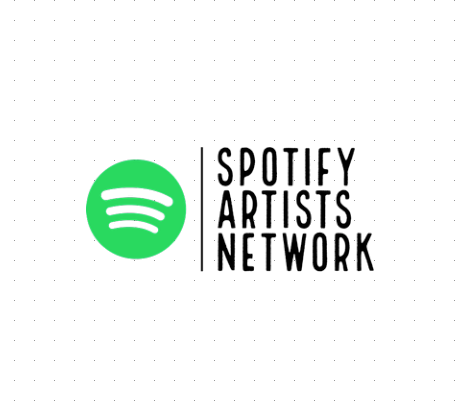

<!--
*** Thanks for checking out the Best-README-Template. If you have a suggestion
*** that would make this better, please fork the repo and create a pull request
*** or simply open an issue with the tag "enhancement".
*** Thanks again! Now go create something AMAZING! :D
-->

<!-- PROJECT SHIELDS -->
<!--
*** I'm using markdown "reference style" links for readability.
*** Reference links are enclosed in brackets [ ] instead of parentheses ( ).
*** See the bottom of this document for the declaration of the reference variables
*** for contributors-url, forks-url, etc. This is an optional, concise syntax you may use.
*** https://www.markdownguide.org/basic-syntax/#reference-style-links
-->

<!-- [![Contributors][contributors-shield]][contributors-url] -->

[![MIT License][license-shield]][license-url]

<!-- [![Forks][forks-shield]][forks-url] -->
<!-- [![Stargazers][stars-shield]][stars-url] -->
<!-- [![Issues][issues-shield]][issues-url] -->

<!-- [![LinkedIn][linkedin-shield]][linkedin-url] -->

<!-- PROJECT LOGO -->
<br />
<p align="center">
  <a href="https://github.com/othneildrew/Best-README-Template">
    
  </a>

  <h3 align="center">Spotify Artists Network</h3>

  <!-- <p align="center">
    An awesome README template to jumpstart your projects!
    <br />
    <a href="https://github.com/othneildrew/Best-README-Template"><strong>Explore the docs »</strong></a>
    <br />
    <br />
    <a href="https://github.com/othneildrew/Best-README-Template">View Demo</a>
    ·
    <a href="https://github.com/othneildrew/Best-README-Template/issues">Report Bug</a>
    ·
    <a href="https://github.com/othneildrew/Best-README-Template/issues">Request Feature</a>
  </p>
</p> -->

<!-- TABLE OF CONTENTS -->
<details open="open">
  <summary>Table of Contents</summary>
  <ol>
    <li>
      <a href="#about-the-project">About The Project</a>
      <ul>
        <li><a href="#built-with">Built With</a></li>
      </ul>
    </li>
    <li>
      <a href="#getting-started">Getting Started</a>
      <ul>
        <li><a href="#prerequisites">Prerequisites</a></li>
        <li><a href="#installation">Installation and Running</a></li>
      </ul>
    </li>
    <li><a href="#usage">Usage</a></li>
    <!-- <li><a href="#roadmap">Roadmap</a></li> -->
    <li><a href="#contributing">Contributing</a></li>
    <li><a href="#license">License</a></li>
    <li><a href="#contact">Contact</a></li>
    <li><a href="#acknowledgements">Acknowledgements</a></li>
  </ol>
</details>

<!-- ABOUT THE PROJECT -->

## About The Project

The Spotify Artists Network makes use of the rich data that Spotify shares about its music artists - especially in the way users like to listen to similar artists. Based on users' listening patterns, Spotify provides a set of similar artists for each selected artist.

I saw this as an opportunity to create an entire network of similar artists and similar artists' similar artists and so on.

The core algorithm is a simple breadth first search that originates at the seed (artist of your choice) and iteratively finds similar artists for each artist next in queue.

[![Product Name Screen Shot][product-screenshot]](https://resumio.herokuapp.com/dashboard)

The network graph is fully interactive. It will respond to zoom, pan, select and resize. The breadth and depth sliders allow to to modify the shape of your search. The artist's popularity, determined by active monthly listeners is encoded by color (refer key to top right of visualization).

One awesome feature is the tiny Spotify media player window that allows the user to hear teh selected artists' music on the website itself.

[![Product Name Screen Shot][product-screenshot2]](https://resumio.herokuapp.com/dashboard)

The search box is designed to be user friendly and intuitive with live autocomplete suggestions for Spotify artists.

[![Product Name Screen Shot][product-screenshot3]](https://resumio.herokuapp.com/dashboard)

### Built With

Listed below are the major frameworks that I built this project using.

- [Python](https://www.python.org)
- [Flask](https://flask.palletsprojects.com/en/1.1.x/)
- [D3](https://d3js.org)

### APIs Used

- [Spotify Web API](https://developer.spotify.com/console/)

<!-- GETTING STARTED -->

## Getting Started

To get a local copy up and running follow these simple steps.

### Installation and Running

<!-- 1. Get a free API Key at [https://example.com](https://example.com) -->

1. Clone the repo

```sh
git clone https://github.com/pezzlex/resumio.git
```

2. Enter your secret information in `config.py`

```Python
SPOTIFY_CLIENT_AUTH = "YOUR SPOTIFY_CLIENT_AUTH"
```

3. Install requirements

```sh
pip install -r requirements.txt
```

4. Run app in development mode

```sh
flask run
```

<!-- ROADMAP -->

<!-- ## Roadmap

See the [open issues](https://github.com/othneildrew/Best-README-Template/issues) for a list of proposed features (and known issues). -->

<!-- CONTRIBUTING -->

## Contributing

Contributions are what make the open source community such an amazing place to be learn, inspire, and create. Any contributions you make are **greatly appreciated**.

1. Fork the Project
2. Create your Feature Branch (`git checkout -b feature/AmazingFeature`)
3. Commit your Changes (`git commit -m 'Add some AmazingFeature'`)
4. Push to the Branch (`git push origin feature/AmazingFeature`)
5. Open a Pull Request

<!-- LICENSE -->

## License

Distributed under the MIT License. See `LICENSE` for more information.

<!-- CONTACT -->

## Contact

Pezanne Khambatta - [Email](pezanne_khambatta@brown.edu) - pezanne_khambatta@brown.edu

Project Link: [https://github.com/pezzlex/resumio.git](https://github.com/pezzlex/resumio.git)

<!-- ACKNOWLEDGEMENTS -->

## Acknowledgements

- D3 Network Graph - [Mike Bostock](https://observablehq.com/@d3/force-directed-graph)
- D3 Voronoi (and actual guidance) - [Sophie Engle](https://bl.ocks.org/sjengle/2e58e83685f6d854aa40c7bc546aeb24)
- Project Feedback and Suggestions - [Jake Zhong](https://github.com/jakezhong)
- README template - [othneildrew](https://github.com/othneildrew/Best-README-Template)
- License - [MIT License](https://github.com/pezzlex/resumio/blob/master/LICENSE.txt)

<!-- MARKDOWN LINKS & IMAGES -->
<!-- https://www.markdownguide.org/basic-syntax/#reference-style-links -->

[contributors-shield]: https://img.shields.io/github/contributors/othneildrew/Best-README-Template.svg?style=for-the-badge
[contributors-url]: https://github.com/pezzlex/resumio/contributors
[forks-shield]: https://img.shields.io/github/forks/othneildrew/Best-README-Template.svg?style=for-the-badge
[forks-url]: https://github.com/othneildrew/Best-README-Template/network/members
[stars-shield]: https://img.shields.io/github/stars/othneildrew/Best-README-Template.svg?style=for-the-badge
[stars-url]: https://github.com/othneildrew/Best-README-Template/stargazers
[issues-shield]: https://img.shields.io/github/issues/othneildrew/Best-README-Template.svg?style=for-the-badge
[issues-url]: https://github.com/othneildrew/Best-README-Template/issues
[license-shield]: https://img.shields.io/github/license/othneildrew/Best-README-Template.svg?style=for-the-badge
[license-url]: https://github.com/othneildrew/Best-README-Template/blob/master/LICENSE.txt
[linkedin-shield]: https://img.shields.io/badge/-LinkedIn-black.svg?style=for-the-badge&logo=linkedin&colorB=555
[linkedin-url]: https://linkedin.com/in/othneildrew
[product-screenshot]: readme_images/san-2.png
[product-screenshot2]: readme_images/san-3.png
[product-screenshot3]: readme_images/san-4.png
